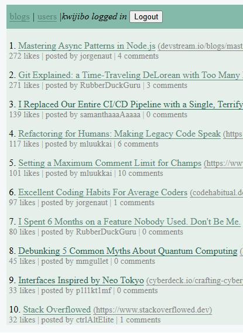

# Hacker News-lite like

This is a blog application built with React. It was created as a set of exercises to develop general full stack skills like state management, user authentication and authorization, and other core React concepts like custom hooks, component composition, and routing with React Router.

This project is a work-in-progress and a learning ground. **Feedback, suggestions, and contributions are highly encouraged!** If you see something that could be improved, or have an idea for a new feature, please open an issue or get in contact.

## Contributing

This is a welcoming space for learning and collaboration. 

No contribution is too small. Whether it's fixing a typo in the documentation, refactoring a component, or adding a major new feature, all help is appreciated.
